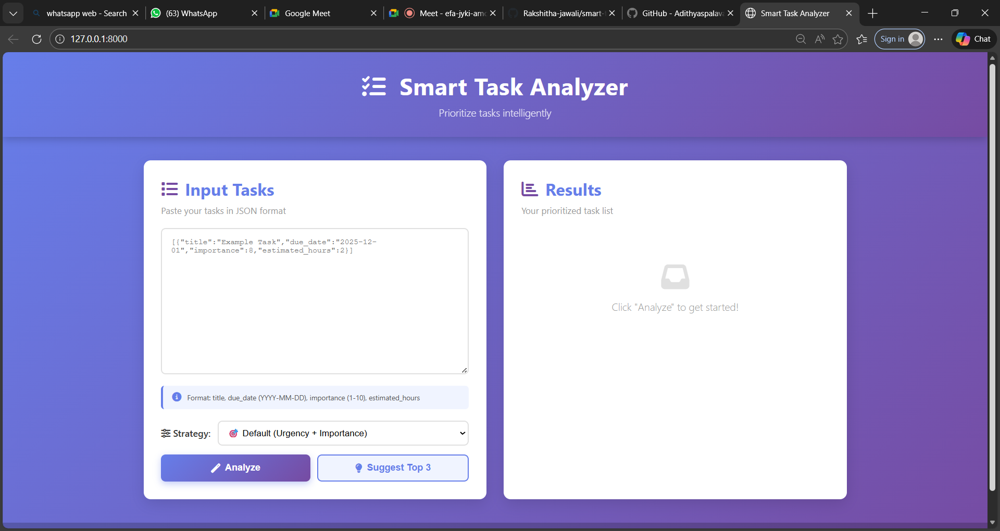

# Smart Task Analyzer

A mini intelligent task-prioritization system built with **Django + Vanilla JavaScript**.  
It analyzes urgency, importance, effort, and dependencies to calculate a priority score and recommend the top tasks.


## 📸 Screenshot


---

## 🚀 Quick Start (Local)

1. Create project folder `task-analyzer` and place files accordingly.

2. Create virtual environment:

```bash

## Quick start (local)
1. Create project folder `task-analyzer` and place files accordingly.
2. Create venv:

  python -m venv venv

for running the projects use this cmd in your Device
# activate venv first (example for Windows & Unix)
# Windows:
venv\Scripts\activate
# mac/linux:
source venv/bin/activate

pip install -r requirements.txt        # or pip install django

python manage.py makemigrations
python manage.py migrate
python manage.py runserver

## sample json file to test
[
  {"id": 1, "title": "Fix critical bug", "due_date": "2025-12-01", "importance": 10, "estimated_hours": 3, "done": false},
  {"id": 2, "title": "Write README", "due_date": "2025-11-30", "importance": 6, "estimated_hours": 1, "done": false},
  {"id": 3, "title": "Setup CI", "due_date": "2025-12-10", "importance": 8, "estimated_hours": 6, "dependencies": [1], "done": false},
  {"id": 4, "title": "Old task", "due_date": "1990-01-01", "importance": 5, "estimated_hours": 2, "done": false}
]

# file strecture
task-analyzer/
├── manage.py
├── requirements.txt
├── backend/
│   ├── __init__.py
│   ├── settings.py
│   ├── urls.py
│   └── wsgi.py
├── tasks/
│   ├── __init__.py
│   ├── migrations/
│   │   └── 0001_initial.py
│   ├── models.py
│   ├── scoring.py
│   ├── urls.py
│   └── views.py
├── frontend/
│   ├── static/
│   │   ├── css/
│   │   │   └── styles.css
│   │   ├── js/
│   │   │   └── script.js
│   │   └── favicon.ico
│   └── templates/
│       └── index.html
└── README.md

# 🌐 API Endpoints
| Method   | Endpoint              | Description                                      |
| -------- | --------------------- | ------------------------------------------------ |
| **POST** | `/api/tasks/analyze/` | Returns all tasks with computed scores           |
| **POST** | `/api/tasks/suggest/` | Returns top 3 recommended tasks with explanation |


#🧠 How the Scoring Algorithm Works

Each task receives a score based on:
✔️ Urgency
Overdue → +100
Due in ≤ 3 days → +50

✔️ Importance
Weighted heavily (importance × 5)

✔️ Effort (Quick Wins)
< 2 hours → +10 bonus

✔️ Dependencies
Dependent tasks get penalty
Independent tasks rank higher

✔️ Done flag
Completed tasks fall automatically to bottom